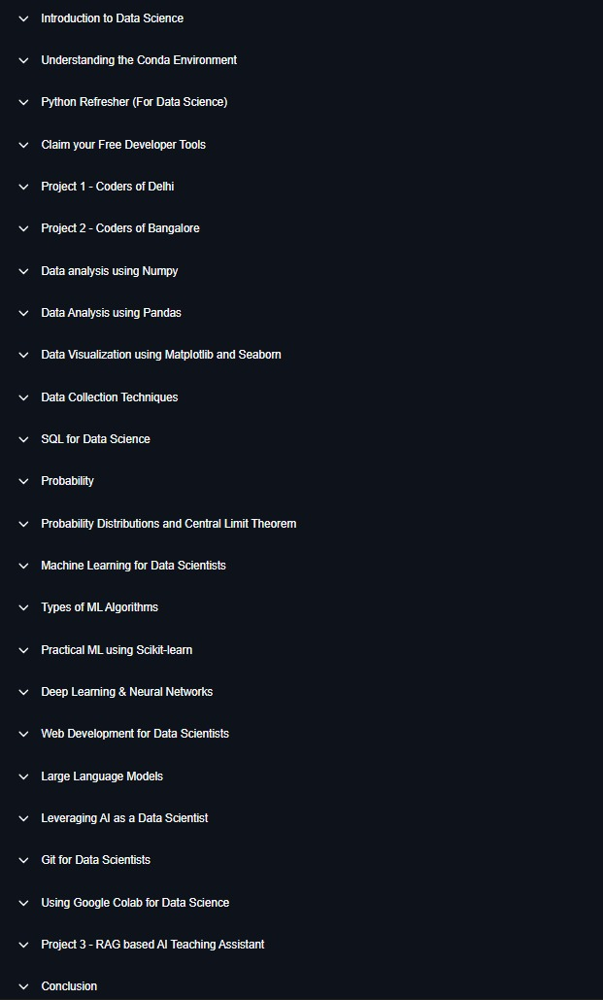

# Data Science and Data Analysis Learning Roadmap

This repository is my complete learning workspace for Data Science.
I use it to learn concepts, write code, practice notebooks, and build projects in a structured order.

## Roadmap



## Learning Flow (Recommended Order)

Follow this sequence to keep learning clear and practical:

1. Build foundation in Python and environment setup.
2. Learn NumPy for array operations and numerical thinking.
3. Learn Pandas for real dataset analysis.
4. Learn statistics and probability for data intuition.
5. Learn plotting and visualization.
6. Start EDA and BI-style analysis on datasets.
7. Move to machine learning and advanced AI topics.

## Current Repository Structure

```text
.
|-- 0 Documents/
|-- 1 Data analysis using pandas/
|   |-- 1/
|   |   |-- 1 first.ipynb
|   |   |-- csvdata1.csv
|   |   |-- googleplaystore.csv
|   |   |-- text.txt
|   |   `-- xldata1.xlsx
|   `-- 2/
|       |-- 2 second.ipynb
|       |-- d1.csv
|       `-- d2.csv
|-- 2 Statistice using python/
|   `-- 1.ipynb
|-- 3 Data analysis using numpy/
|   `-- 1.ipynb
|-- 4 Ploatting/
|   `-- 1.ipynb
|-- 4 Ploating 
|-- BI /
|   `-- first.txt
|-- EDA/
|-- map.jpeg
`-- README.md
```

## Folder Purpose

- `0 Documents/`: Reference PDFs, notes, and theory material.
- `1 Data analysis using pandas/`: Pandas practice with multiple datasets and notebooks.
- `2 Statistice using python/`: Statistics practice in Python.
- `3 Data analysis using numpy/`: NumPy fundamentals and exercises.
- `4 Ploatting/`: Visualization notebook(s).
- `BI /`: Business intelligence related notes/work.
- `EDA/`: Exploratory Data Analysis practice.
- `map.jpeg`: Main roadmap image used in this README.

## How I Will Use This Repo

For each topic, I will keep a consistent pattern:

1. Read concepts from `0 Documents/`.
2. Write practice code in notebooks.
3. Save datasets in the same topic folder.
4. Add one mini project or analysis summary.
5. Commit progress regularly with clear commit messages.

## Suggested Naming Rules (From Now)

- Keep folder names short and consistent.
- Avoid spaces at the end of folder names.
- Use lowercase with underscores where possible.
- Notebook names should describe the task, for example:
	- `01_numpy_basics.ipynb`
	- `02_pandas_cleaning.ipynb`
	- `03_eda_googleplaystore.ipynb`

## Short-Term Roadmap Goals

1. Complete NumPy and Pandas basics with hands-on exercises.
2. Finish statistics notebook with practical examples.
3. Create at least 2 EDA case studies using real datasets.
4. Add clean visualizations in plotting notebooks.
5. Start first machine learning end-to-end notebook.

## Long-Term Outcome

By following this roadmap and structure, this repository should become:

- A complete revision guide for interviews.
- A portfolio of practical Data Science work.
- A clear growth path from beginner to project-ready level.
